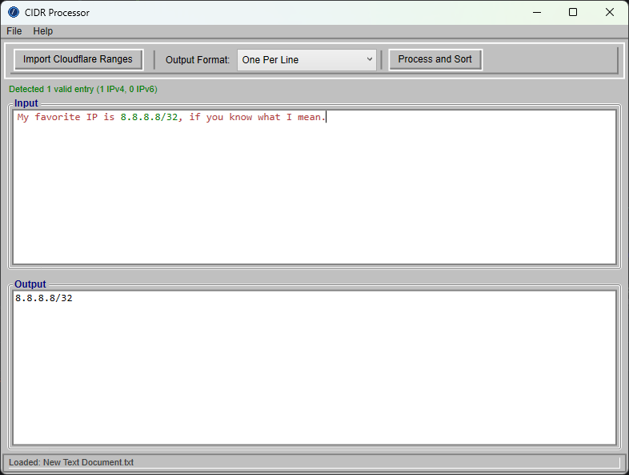

# CIDR.WPF

A Windows desktop utility for processing, sorting, and formatting CIDR subnets and IP addresses. Built with WPF on .NET 10.0.



## Features

*   **CIDR/IP Parsing**: Extracts valid IPv4 and IPv6 addresses and CIDR subnets from any text input.
*   **Syntax Highlighting**: Recognized entries are highlighted green in the input panel; unrecognized text is shown in red so it is clear what was and was not detected.
*   **Auto-Processing**: Input is parsed and sorted automatically on paste, type, drag-and-drop, or API import — no manual button click required.
*   **Sorting**: Automatically sorts IP addresses numerically (IPv4 first, then IPv6).
*   **Cloudflare Integration**: Retrieves the current Cloudflare IP ranges directly from their public API.
*   **Flexible Output Formats**:
    *   **One Per Line**: Standard list format.
    *   **Space-Delimited**: Useful for command-line arguments or scripts.
    *   **F5 BigIP Format**: Formatted as F5 BigIP network statements (`network <cidr>,`).
    *   **Nginx Allow**: Formatted as Nginx allow directives (`allow <cidr>;`).
    *   **Apache Require**: Formatted as Apache 2.4 access directives (`Require ip <cidr>`).
*   **File Operations**: Open input files and save formatted output using standard Windows dialogs (`Ctrl+O` / `Ctrl+S`).
*   **Drag & Drop**: Drag a text file directly onto the window or input area to load it.
*   **Command Line**: Pass a file path as an argument to open it on launch: `CIDR.WPF.exe myfile.txt`

## Keyboard Shortcuts

| Shortcut | Action |
|----------|--------|
| `Ctrl+O` | Open a text file |
| `Ctrl+S` | Save output to a file |
| `Alt+F`  | File menu |
| `Alt+I`  | Import Cloudflare Ranges |
| `Alt+M`  | Focus the Output Format selector |
| `Alt+P`  | Process and Sort |
| `Alt+H`  | Help menu |

## Getting Started

### Prerequisites

*   Windows OS (WPF application)
*   .NET 10.0 Runtime (or SDK to build)

### Usage

1.  **Input Data**: Paste text containing IPs or subnets into the Input panel, drag and drop a text file, or click **Import Cloudflare Ranges**.
2.  **Review**: Recognized entries highlight green automatically; unrecognized text appears red.
3.  **Select Format**: Choose your desired output format from the dropdown.
4.  **Result**: The sorted and formatted list appears in the Output panel automatically.
5.  **Save**: Use `Ctrl+S` or **File > Save Output...** to export results.

## Building the Project

This project uses .NET 10.0.

```powershell
dotnet restore
dotnet build
```

## Code Style

This project includes an `.editorconfig` file that enforces consistent formatting. Use `dotnet format` to auto-fix style issues:

```powershell
dotnet format
```

## CI/CD

The project includes a GitHub Actions workflow (`.github/workflows/dotnet.yml`) that:

1.  Builds the application for Windows x64 in Release configuration.
2.  Publishes a self-contained single-file executable.
3.  Uploads build artifacts to GitHub Actions.

### Releases

Push a version tag to create an official GitHub Release with the compiled executable:

```bash
git tag v1.2.0
git push origin v1.2.0
```

The tag version (e.g. `1.2.0`) is automatically injected into the assembly version and used as the release name.

### Build Metadata

The CI pipeline embeds git commit SHA, branch/tag name, and build date into the assembly. This information is displayed in the **Help > About** dialog at runtime.
